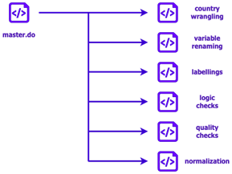

# EU-GPP
GitHub repo containing all the required files for the execution of the cleaning and harmonization protocol of the GPP data collected under the EU Subnational project. The protocol document is publicly available through the [EU-Copilot web app](https://eu-copilot.streamlit.app/) or it can directly downloaded using [this link](https://github.com/ctoruno/EU-copilot/blob/main/inputs/GPP-cleaning-and-validation-protocol.pdf).

The cleaning and harmonization of the data is done using the [Stata Statistical package](https://www.stata.com/). The workfow described here appliess for both, pretest and full fieldwork stages of data collection.

## Files description
In this repository you will find three main folders:
1. `Metadata`
2. `Data`
3. `Code`

The `Metadata` directory contains general information on the NUTS regions that are beeing studied. Additionally, here you can find the data map and the data codebook.

The `Data` directory contains all the data files collected during this project. The data is divided in three categories:
- PTR: Data collected during the pretest stage, organized by country.
- FFW: Data collected during the full fieldwork stage, organized by country.
- Merge: Latest merged data file.

The `Code` directory contains all the scripts for cleaning and harmonizing the data collected during the pretest and full fieldwork stage. The cleaning routines are divided into two groups:
- Country Wrangling: Here are the routines that are country/company specific and which main objective is to transform the data received by the polling company in order to resemble the structure displayed in the data map.
- Routines: Here are the routines that can be called and be automatically applied to the data once that the data resembles the structure displayed in the data map.

Due to the privacy discloures followed by the DAU (see the [DAU R Coding Handbook](https://ctoruno.quarto.pub/wjp-r-handbook/)), the contents of the `Data` directory is limited on the GitHub repository and their full content can only be accessed through the WJP SharePoint.

## Code logic
The code follows a modular programming approach. Under this approach, there is a MASTER dofile called `master_2023.do` in the root directory of the repository. Following the instructions in the master file, the analyst only needs to specify four global parameters:
- Country name
- Data Stage (Pretest or Fieldwork)
- Year
- Data file name (usually as SAV)

Once these four parameters are specified, the rest of the master can be run automatically. As long as the data file follows the same data structure as the one displayed in the data map. If the data submitted by the polling company differs from the structure displayed in the data map, please define a country-wrangling routine with the following syntax in the `2. Code/Country-Wrangling` folder: 
```
{country_name}_wrangling{year}.do
``` 

This routine will be called by the master file before applying all the other routines in the `2. Code/Routines` folder.

Even though the master file can be run automatically, we recommend running each call individually, specially when it comes to the logic, randomization, routing, and quality checks. During these checks, the analyst needs to go through the console and search for any **RED** flag raised by the checks. The figure below depicts how the code logic works:



## Contact
For inqueries please contact _Carlos Toruño_ (ctoruno@worldjusticeproject.org) or _Natalia Rodriguez_ (nrodriguez@worldjusticeproject.org).